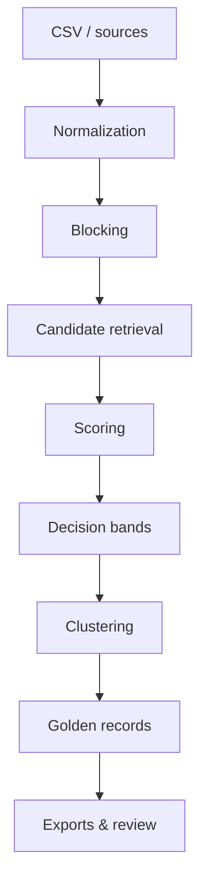

# Linkuity

[](https://github.com/linkuity/linkuity/actions/workflows/ci.yml)
[](LICENSE)
[](https://dotnet.microsoft.com/)

**Open-source entity resolution and golden-record engine.**

Linkuity finds the records that refer to the same person or organization, links them
into clusters, and merges each cluster into one explainable golden record — all inside
your own environment.

- 🔍 **Detect duplicates** across CSVs, systems, and incremental loads
- 🧩 **Build golden records** with source-aware merge rules
- 🧠 **Explain every match** with per-field score breakdowns
- 🔒 **Run locally or privately** — no customer data leaves your environment
- ♻️ **Batch or durable incremental** resolution as data arrives over time


## Quick start

**Prerequisites:** [.NET 10 SDK](https://dotnet.microsoft.com/download).

Resolve the bundled 28-record sample into golden records:

```powershell
git clone https://github.com/linkuity/linkuity.git
cd linkuity
dotnet run --project src/Linkuity.Cli -- run `
  --input samples/people-multi-source/sample.csv `
  --config samples/people-multi-source/match-config.json `
  --output ./data/output/people-multi-source
```

```text
Job 5f3a…c21e completed.
Golden records: …/data/output/people-multi-source/golden-records.csv
```

**28 source records from CRM, Marketing, Support, and Billing → 10 golden records.**
Add `--neo4j-export` to also write a graph bundle. Next: the guided
[durable MDM quick start](docs/tutorials/cli-durable-mdm-quickstart.md).

> The demo above is generated from [`docs/assets/demo.tape`](docs/assets/demo.tape) by the
> [Demo GIF workflow](.github/workflows/demo-gif.yml) — see [docs/assets](docs/assets/README.md).

## Before and after

Real systems rarely store a person the same way twice — a nickname here, a typo there, a
phone number in a different format:

| id | source | first_name | last_name | email | phone | address_line |
|----|--------|------------|-----------|-------|-------|--------------|
| crm-050 | CRM | Joseph | Martinez | joseph.martinez@example.com | (312) 555-0147 | 1420 Maple Avenue |
| mkt-051 | Marketing | Joe | Martinez | joe.martinez@example.com | 312-555-0147 | 1420 Maple Ave |
| sup-052 | Support | Joesph | Martinez | joseph.martinez@example.com | 312.555.0147 | 1420 Maple Avenue Apt 3B |
| bil-053 | Billing | Joseph | Martinez | joseph.martimez@example.com | 3125550147 | 1420 Maple Ave Apt 3B |

Every mismatch is one you have probably seen in production: a **nickname** (`Joe`), a
**misspelling** (`Joesph`), a **one-letter email typo** (`martimez`), **one phone in
four formats**, and an **apartment number** that only reached two systems.

Linkuity normalizes, blocks, scores, and clusters these into a single golden record:

| record_count | member_ids | first_name | email | phone | address_line |
|--------------|------------|------------|-------|-------|--------------|
| 4 | crm-050\|mkt-051\|sup-052\|bil-053 | Joseph | joseph.martinez@example.com | +13125550147 | 1420 Maple Ave Apt 3B |

And it is **explainable** — `first_name` wins by consensus (`Joseph` over the nickname
and the typo), `email` by CRM source priority (the typo-free address), `phone`
normalizes to one number, and `address` takes the Billing row with the unit. A golden
record is a *composite*, not a copy of any single row. See
[how matching works](docs/how-matching-works.md) and the
[people-multi-source sample](samples/people-multi-source/README.md).

## Why Linkuity

Most ways to resolve entities fall into one of three buckets, each with a catch: **hosted
matching services** (you ship customer data to someone else's cloud), **closed-source
products** (you can't inspect or tune how matches are decided), and **low-level
fuzzy-matching libraries** (powerful, but you assemble blocking, scoring, clustering,
merging, and persistence yourself).

Linkuity is a complete, open-source engine you run yourself:

| | Hosted service | Closed product | Match library | **Linkuity** |
|---|:---:|:---:|:---:|:---:|
| Open source | ✕ | ✕ | ✓ | ✓ |
| Data stays in your environment | ✕ | varies | ✓ | ✓ |
| Explainable match decisions | varies | ✕ | you build it | ✓ |
| Whole workflow (merge, golden records, persistence) | ✓ | ✓ | ✕ | ✓ |
| Durable incremental resolution | varies | varies | ✕ | ✓ |
| Native .NET, cross-platform | — | — | varies | ✓ |

## Common use cases

- **Customer 360 / MDM** — one trusted record per customer from many systems
- **CRM cleanup & contact deduplication** — collapse duplicate people
- **Supplier / vendor consolidation** — dedupe and standardize organizations
- **Organization resolution** — match companies across name and domain variants
- **Data migrations** — dedupe before loading into a new system
- **Incremental identity resolution** — keep records linked as new data lands
- **Graph analysis** — export resolved entities to Neo4j and explore the links

## How it works



Comparing every record against every other is `N²` and doesn't scale, so Linkuity only
scores candidate pairs that share a cheap **blocking key**, combines per-field
similarities into one score, and sorts each pair into a **decision band**: auto-merge,
review, or no-match. Accepted pairs cluster transitively, and each cluster merges into a
golden record via your source-priority rules — with a per-field breakdown you can read
back. Full detail (with a worked example): [how-matching-works.md](docs/how-matching-works.md).

## Batch mode vs durable mode

| | Batch mode | Durable mode |
|---|---|---|
| Entry point | `linkuity run` | `linkuity project` / `ingest-incremental` |
| State | Stateless — resolves and forgets | Persistent store that remembers |
| New data | Reprocesses the whole file | Matched incrementally against stored records |
| History & review | — | Versioned golden records + review queue |
| Store backend | Output files | Local JSON file **or** PostgreSQL |
| Reach for it when | One-off dedupe, exports, CI | Ongoing MDM as data arrives over time |

The [quick start](#quick-start) uses batch mode. For durable mode, follow the
[durable MDM quick start](docs/tutorials/cli-durable-mdm-quickstart.md); to back it with
PostgreSQL, see [durable-postgres.md](docs/durable-postgres.md).

## Key capabilities

- **Matching engine** — normalization, blocking (including phonetic), weighted
  similarity scoring, Lucene-backed candidate retrieval
- **Explainability** — persisted per-field score breakdowns and read-back commands
- **Golden records** — configurable source-priority merge policies; composite output
- **Two modes** — stateless batch and durable incremental (versioning + review queue)
- **Storage** — local filesystem + JSON store, or a PostgreSQL durable backend
- **Interfaces** — [CLI](docs/cli.md), [HTTP API](docs/http-api.md), and
  [Docker Compose](docs/private-server-deployment.md)
- **Graph export** — Neo4j-ready node/relationship bundle
- **Runtime** — native .NET 10; cross-platform and single-file deployable
- **License** — Apache 2.0

## Examples and samples

The [`samples/`](samples/README.md) directory has small, self-contained datasets — each
with a walkthrough and test-pinned expected results — covering multi-source people and
organization merging, unreliable-field handling, name noise, and durable incremental
scenarios. Start with [people-multi-source](samples/people-multi-source/README.md) (the
28 → 10 example above).

## Documentation

- [How matching works](docs/how-matching-works.md) — blocking, scoring, decision bands, merging, tuning
- [Tutorials](docs/tutorials/README.md) — hands-on durable MDM walkthroughs
- [CLI reference](docs/cli.md) — batch usage and building a standalone binary
- [HTTP API](docs/http-api.md) — synchronous `/run` and health endpoints
- [Durable mode on PostgreSQL](docs/durable-postgres.md) — persistent incremental store
- [Architecture](docs/architecture.md) — components, endpoints, and internals
- [Private runtime](docs/private-runtime.md) & [private server deployment](docs/private-server-deployment.md) — local-first and Docker Compose
- [Optional Azure-compatible local stack](docs/azure-local-stack.md) — Aspire + Azurite (optional)
- [Benchmark plan](docs/benchmarks.md) — how quality/cost will be measured (no results yet)

## Roadmap

Active development. Near-term focus (full plan in [docs/roadmap/PLAN.md](docs/roadmap/PLAN.md)):

- Packaged CLI releases so users don't build from source
- More realistic sample datasets
- Reproducible quality/cost benchmarks ([plan](docs/benchmarks.md))
- Better match explanations and review workflows
- SDK, connector, and plugin guidance
- Larger-scale private-server deployment examples

## Contributing

Contributions are welcome. Start with [CONTRIBUTING.md](CONTRIBUTING.md), which covers
development setup and the Contributor License Agreement ([CLA.md](CLA.md)). Please also
review [CODE_OF_CONDUCT.md](CODE_OF_CONDUCT.md), [SECURITY.md](SECURITY.md), and
[CHANGELOG.md](CHANGELOG.md).

## License

Linkuity is licensed under the [Apache License 2.0](LICENSE).
