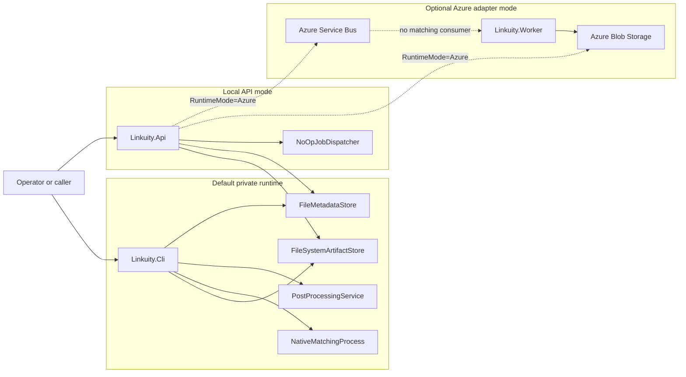
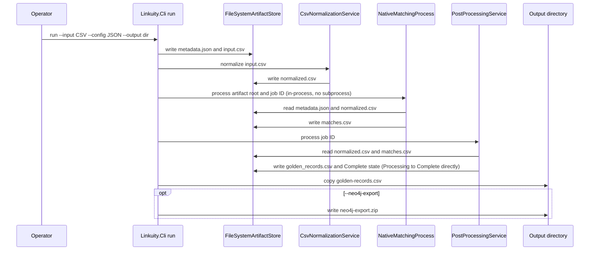
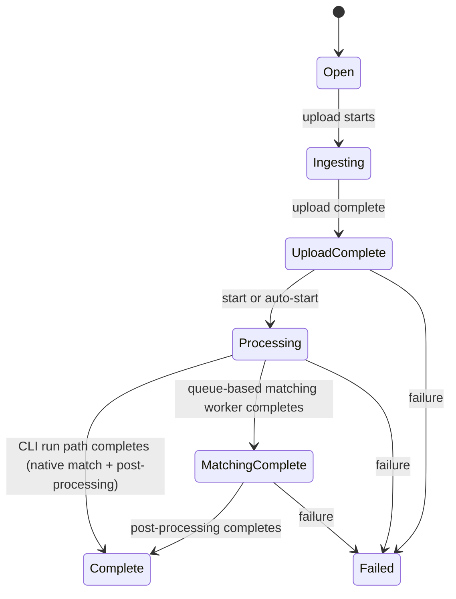
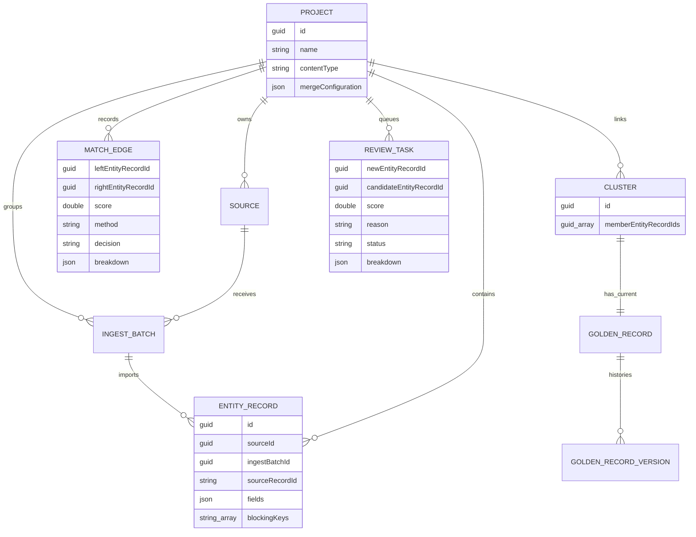
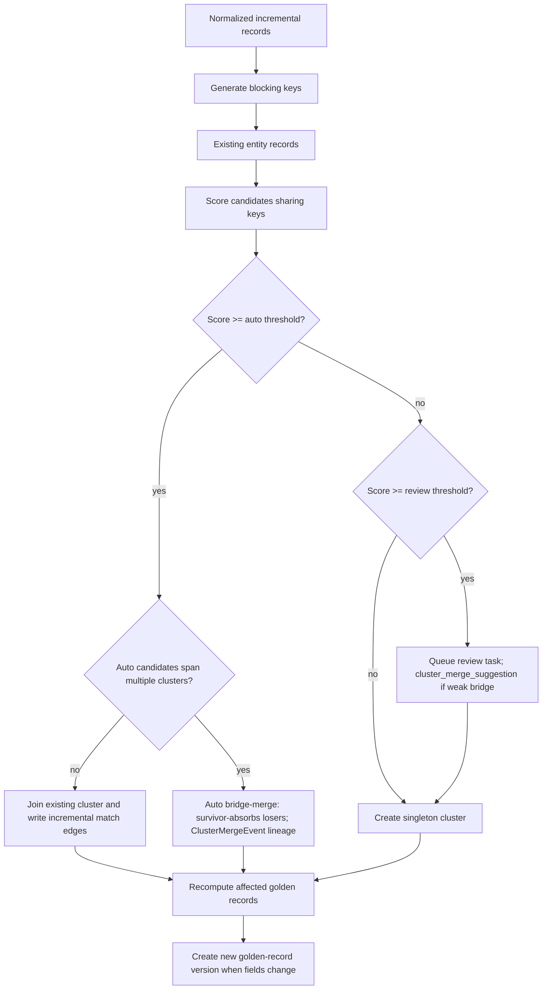

# Linkuity Architecture

Linkuity is an open-source private-runtime golden-record engine for data and
MDM teams. It normalizes source records, finds likely duplicates, links related
records into clusters, and produces golden records without requiring customer
data to leave the customer's environment.

The current codebase has three supported execution shapes:

- A local CLI batch runner that processes CSV files from the local filesystem.
- A private-server batch path that packages the same CLI runner in Docker
  Compose with bind-mounted data directories.
- An HTTP batch API that defaults to local filesystem artifacts and can opt into
  the Azure-compatible adapter path with `Linkuity:RuntimeMode=Azure`.

Azure Blob Storage and Azure Service Bus are adapter infrastructure, not the
default architecture.

## Runtime Overview



## Project Structure

| Project or folder | Current role |
|---|---|
| `src/Linkuity.Core` | Shared domain models, runtime enum, interfaces, validation, normalization, and vocabulary |
| `src/Linkuity.Pipeline` | Reusable graph clustering, golden-record merge, and post-processing service |
| `src/Linkuity.Cli` | Local batch runner plus durable metadata commands |
| `src/Linkuity.Api` | HTTP batch job API, project/source/batch metadata API, health endpoint, and runtime infrastructure selection |
| `src/Linkuity.Worker` | Optional .NET background host; in Azure mode consumes post-processing queue messages |
| `src/Linkuity.Infrastructure.Local` | Filesystem artifact store and JSON-backed metadata store |
| `src/Linkuity.Infrastructure.Azure` | Optional Azure Blob Storage and Azure Service Bus adapters |
| `src/Linkuity.Infrastructure.Postgres` | PostgreSQL durable metadata store adapter (Npgsql + Dapper + DbUp, no EF Core) |
| `src/Linkuity.Mdm` | Shared MDM resolution core: `IncrementalResolver`, working-set and mutation ports, golden-record, merge-event, review-task, and cluster-merge logic; consumed by both metadata store adapters |
| `src/Linkuity.Mdm.Benchmarks` | Measurement harness for durable store performance: synthetic dataset generation and batched-ingest wall-clock + peak-memory measurement (CSV/markdown output) |
| `src/Linkuity.AppHost` | Optional Aspire host for Azure-emulator development |

## Core Boundaries

| Boundary | Implementation |
|---|---|
| Artifact storage | `IArtifactStore` with `FileSystemArtifactStore` and `AzureBlobArtifactStore` implementations |
| API batch artifact compatibility | `IBlobStore`, currently an `IArtifactStore` subtype used by older API services |
| Metadata storage | `IMetadataStore`, implemented by `FileMetadataStore` (JSON-backed, small/dev default) and `PostgresMetadataStore` (scalable tier, Npgsql + Dapper + DbUp); backend selected by `Linkuity:MetadataStore` configuration |
| Dispatch | `IJobDispatcher`, implemented by `NoOpJobDispatcher` in local API mode and `AzureServiceBusJobDispatcher` in Azure mode |
| Normalization | `CsvNormalizationService` plus `FieldNormalizer` |
| Matching (standalone batch) | .NET native matcher (`NativeMatchingProcess`) reusing `Linkuity.Matching` — see Batch matching (`linkuity run`) |
| Matching (durable incremental) | .NET matching engine (`Linkuity.Matching`) with Lucene.NET candidate retrieval; the strategic matcher |
| Post-processing | `PostProcessingService`, `GraphService`, and `GoldenRecordService` |
| Delivery | CLI output files, API download endpoints, Neo4j export ZIP, and durable metadata reads |

The batch pipeline is transport-neutral only after normalization. The CLI calls
`NativeMatchingProcess` in-process — no subprocess, no external service — reusing the
same `Linkuity.Matching` engine that drives the durable incremental path (see Batch
matching (`linkuity run`)). The Azure adapter path has no matching consumer; the supported
match paths are `linkuity run` (native, standalone) and `linkuity ingest-incremental`
(native, durable).

## Runtime Modes

| Mode | Current behavior | Infrastructure |
|---|---|---|
| Local CLI | Runs a complete batch job locally and optionally writes Neo4j export | Local filesystem artifacts; matching runs in-process (`NativeMatchingProcess`) |
| Private server batch | Runs the CLI pipeline inside Docker Compose with bind-mounted directories | Customer-managed server filesystem |
| Local API | Creates/uploads/normalizes batch jobs and stores artifacts locally; dispatch is currently a placeholder | Local filesystem artifacts and local JSON metadata |
| Azure adapter | Normalizes and dispatches over the queue-backed pipeline; there is no matching consumer, so jobs do not reach `MatchingComplete` | Azure Blob Storage and Azure Service Bus |

The first production target is a private runtime that customers run where their
data already lives. Linkuity does not require a Linkuity-hosted data plane.

## Local Batch Flow

The CLI `run` command is the default end-to-end private batch path.



CLI batch artifacts are written under the requested output directory:

```text
{output}/
  golden-records.csv
  neo4j-export.zip              optional
  artifacts/
    {jobId}/
      metadata.json
      input.csv
      normalized.csv
      matches.csv
      golden_records.csv
```

Standalone `run` is self-contained. It reads match configuration and optional
`mergeConfiguration` from the run config file and does not require a durable MDM
project.

## HTTP API

`Linkuity.Api` exposes two groups of endpoints.

Batch job endpoints:

| Method | Path | Purpose |
|---|---|---|
| `POST` | `/jobs` | Create a batch job |
| `POST` | `/jobs/{id}/upload` | Upload CSV input, maximum 50 MB |
| `POST` | `/jobs/{id}/upload-complete` | Mark upload complete and optionally auto-start |
| `POST` | `/jobs/{id}/start` | Normalize and dispatch processing |
| `GET` | `/jobs/{id}` | Read job metadata |
| `GET` | `/jobs/{id}/golden-records` | Download `golden_records.csv` after completion |
| `GET` | `/jobs/{id}/neo4j-export` | Download a Neo4j import ZIP after completion |
| `GET` | `/health` | Health check |

Durable project metadata endpoints:

| Method | Path | Purpose |
|---|---|---|
| `POST` | `/projects` | Create a project with optional merge policy |
| `GET` | `/projects` | List projects |
| `GET` | `/projects/{projectId}` | Read one project |
| `PUT` | `/projects/{projectId}/merge-policy` | Replace a project's merge policy |
| `POST` | `/projects/{projectId}/sources` | Create a source |
| `GET` | `/projects/{projectId}/sources` | List sources |
| `POST` | `/projects/{projectId}/sources/{sourceId}/batches` | Create an ingest batch |
| `GET` | `/projects/{projectId}/batches` | List ingest batches |

In default local API mode, `RuntimeInfrastructureRegistration` wires:

- `FileMetadataStore` at `MetadataStorage:DatabasePath`, default
  `.linkuity/metadata/linkuity.json`.
- `FileSystemArtifactStore` at `ArtifactStorage:RootPath`, default
  `.linkuity/jobs`.
- `NoOpJobDispatcher`.

That means local API mode can create, upload, normalize, and store jobs, but it
does not yet run server-side local matching and post-processing after
`POST /jobs/{id}/start`. Use the CLI or Docker Compose batch path for the
current local end-to-end private runtime.

## Batch Job State Machine



| From | To | Trigger |
|---|---|---|
| `Open` | `Ingesting` | `POST /jobs/{id}/upload` starts storing input |
| `Ingesting` | `UploadComplete` | `POST /jobs/{id}/upload-complete` |
| `UploadComplete` | `Processing` | `POST /jobs/{id}/start` or `AutoStart = true` |
| `Processing` | `Complete` | `NativeMatchingProcess` writes `matches.csv`, then `PostProcessingService` writes golden records and sets `Complete` directly (CLI `run` path; no `MatchingComplete` stop) |
| `Processing` | `MatchingComplete` | Would be written by a queue-based matching worker; the Azure adapter has no matching consumer, so nothing currently produces this transition |
| `MatchingComplete` | `Complete` | `PostProcessingService` writes golden records (only applicable if a matching-worker path reaches `MatchingComplete`) |
| Any processing state | `Failed` | Stage failure updates job metadata where possible |

## Normalization

*For the practitioner concept and a worked example, see [`how-matching-works.md`](how-matching-works.md) (Normalization).*

Before matching, configured fields are normalized by semantic type.

| Semantic type | Normalization |
|---|---|
| `Phone` | E.164 format |
| `Email` | Lowercase and trimmed |
| `DomainName` | Lowercase and trimmed |
| `DateOfBirth` | ISO 8601 date |
| `FirstName` / `LastName` / `FullName` | Honorifics stripped and trimmed |
| `PostalCode`, `AddressLine`, `OrganizationName` | Trimmed |
| `SourceIdentifier` | Passed through unchanged and must not participate in matching |
| `Sku`, `Gtin`, `ProductName` | Passed through unchanged |
| Other fields | Passed through unchanged |

`MatchConfiguration` must contain at least one field with
`ParticipatesInMatching = true`, must not duplicate field names, and must not
mark a `SourceIdentifier` field as participating in matching.

## Authoring a matching profile (no code changes)

*For the practitioner concept and a worked example, see [`how-matching-works.md`](how-matching-works.md) (The profile model).*

A matching profile is the entire configuration for one content type (taxonomy).
The engine has no per-taxonomy code: adding a new content type that uses existing
semantic types, evaluators, and strategies is a pure configuration change.

A profile is a JSON file (`*.profile.json`) loaded at runtime. Durable CLI
commands accept `--profiles <file|dir>`; loaded profiles are registered alongside
the built-in `person` profile, and a project resolves the profile whose
`contentType` matches the project's `--content-type`.

### Schema

| Key | Meaning |
|---|---|
| `contentType` | Selects this profile for projects of the same content type. |
| `fields[]` | One entry per data column that participates in matching. |
| `fields[].name` | Column name in the input data. |
| `fields[].semanticType` | One of: `FirstName, LastName, FullName, Email, Phone, DateOfBirth, AddressLine, PostalCode, OrganizationName, DomainName, SourceIdentifier, Sku, Gtin, ProductName`. |
| `fields[].roles` | Any of `Searchable`, `Matchable`, `Blocking`, `Identifier` (empty = ignored for matching, e.g. a `SourceIdentifier`). A field marked `Identifier` is a strong identifier: an exact match auto-matches a pair (given a shared blocking key), and the field also produces an exact blocking key. |
| `fields[].similarityEvaluator` | `exact`, `fuzzy`, `jaccard`, `ngram`, `numeric`, or `date`. |
| `fields[].weight` | Relative weight in weighted scoring (default 1.0). |
| `fields[].evaluatorOptions` | Optional per-evaluator settings, e.g. `{ "ngram.size": "3" }`. |
| `normalizationStrategy` | e.g. `identity`, `semantic-field`. |
| `blockingStrategies[]` | e.g. `exact-value`, `token-name`, `prefix`, `ngram`, `phonetic`. |
| `candidateRetrievalStrategy` | e.g. `linear` (the durable store overrides this with its index-backed retrieval per ingest). |
| `similarityStrategy` / `scoringStrategy` / `decisionStrategy` / `clusteringStrategy` | e.g. `field-weighted` / `identifier-weighted` / `threshold` / `union-find`. |
| `autoMatchThreshold` / `reviewThreshold` | Decision bands in `[0,1]`, with auto ≥ review. |
| `reviewFloorGate` | Minimum weighted similarity (default `0.75`) a non-identifier pair must reach before the `0.80` review floor is applied; below it the raw weighted score stands. |

Every name is validated at load time against the strategy registry; an unknown
strategy, evaluator, semantic type, or role fails loudly with a message naming
the offending value, so an invalid profile never silently falls back.

Fields declared with the `Identifier` role are the strong identifiers: an exact
match on any of them auto-matches a pair (given a shared blocking key), and each
such field also produces an exact blocking key. The built-in `person` profile
declares it on `email`, `phone`, `date_of_birth`, and `domain_name`; the built-in
`organization` profile declares it on `domain_name`, `email`, and `phone`. Any
profile can declare the `Identifier` role on its own fields with no engine change
— for example, the Product profile declares it on `sku` and `gtin`.

### Worked example

`samples/durable/organization-360/organization.profile.json` is a complete
organization profile. Run the sample with:

```powershell
pwsh scripts/Run-DurableScenario.ps1 -ScenarioPath samples/durable/organization-360
```

### How taxonomies scale

| Layer | Needs | Engine change? |
|---|---|---|
| 1. Config-only | Fields map to existing semantic types; existing strategies/evaluators | None — just a profile file (e.g. organizations, product) |
| 2. Shared vocabulary extension | A new reusable semantic type, identifier, normalization rule, or evaluator | Additive, reusable across taxonomies |
| 3. New strategy | A novel matching algorithm | Rare |

Most new taxonomies are Layer 1. A Layer-2 term added for one taxonomy joins the
shared vocabulary, so the next taxonomy that needs it is back to Layer 1.

### Profile defaults, built-ins, and override semantics

Two profiles ship with the engine and require no configuration:

| Built-in profile | Content type |
|---|---|
| `person` | `person` |
| `organization` | `organization` |

Both are returned by `DefaultMatchingProfileProvider.BuiltInProfiles()` and are
registered automatically on startup. A project whose `--content-type` matches
either resolves immediately with no `--profiles` flag needed.

**Override semantics.** Built-ins register first. A loaded JSON profile (CLI
`--profiles <file|dir>` or API
`AddLinkuityMatchingDefaults(o => o.LoadProfilesFrom(...))`) whose `contentType`
matches a built-in silently replaces that built-in. This lets teams supply a
customized `person` or `organization` profile without touching engine code.
Declaring two loaded profiles with the same `contentType` is an authoring error
and throws at startup.

**Unknown content type.** There is no silent fallback. Resolving a content type
that has no built-in and no loaded profile throws a descriptive error that names
the unrecognized type and lists every registered profile. Register a profile via
`--profiles` (CLI) or `LoadProfilesFrom` (API).

**API/CLI parity.** Both paths use the same `MatchingProfileConfigLoader`, the
same `BuiltInProfiles()` call, and the same provider with identical override and
throw semantics. A profile that works from the CLI works unchanged through the API.

**Orthogonality with the Layer model.** The profile-defaults model is orthogonal
to the Layer-1/2/3 taxonomy model described above. The loader accepts any
syntactically valid profile; whether a domain is genuinely config-only still
depends on its Layer. `samples/durable/organization-360` — whose profile is
`samples/durable/organization-360/organization.profile.json` — is a Layer-1
example: organizations map entirely to existing semantic types, so the built-in
profile can be used as-is or replaced by a custom file. The `product` content
type is also Layer-1: `FieldRole.Identifier` plus the `Sku`, `Gtin`, and
`ProductName` vocabulary additions make it config-only, with
`samples/durable/product-360` as the worked example
(`samples/durable/product-360/product.profile.json`).

## Batch matching (`linkuity run`)

The CLI `run` command's matching stage is `NativeMatchingProcess`, an in-process
`IMatchingProcess` implementation — no subprocess, no external service — that reuses
`Linkuity.Matching`, the same engine that drives the durable incremental path.

Flow: normalize → `NativeMatchingProcess` → post-process → golden records.

1. `MatchConfigurationProfileFactory` synthesizes a `MatchingProfile` from the run's
   `MatchConfiguration`: field roles, evaluators, and weights are copied from the
   built-in `person`/`organization` profile (matched by semantic type) and remapped
   onto the run's actual column names. Retrieval is forced to the blocking-gated
   `blocking-linear` strategy — the identifier-weighted scorer's review floor assumes
   every scored candidate already shares a blocking key.
2. For each normalized record, the engine generates blocking keys and resolves
   candidates against the rest of the batch, keeping the highest-scoring pair per
   candidate at or above `AutoMatchThreshold`.
3. `NativeMatchingProcess` writes the deduplicated pairs to `matches.csv`.
   `PostProcessingService` then reads them and sets job state to `Complete` directly —
   the `run` path has no intermediate `MatchingComplete` write.

*For blocking strategies, scoring, and tuning in depth, see
[`how-matching-works.md`](how-matching-works.md).*

`matches.csv` contains:

| Column | Description |
|---|---|
| `left_id` | ID of the first record in the pair |
| `right_id` | ID of the second record in the pair |
| `similarity` | engine match score (identifier-weighted) |
| `fuzzy_similarity` | Always empty in the native path; retained for schema compatibility with the Neo4j export |

## Post-Processing

`PostProcessingService` reads `normalized.csv` and `matches.csv`, then:

1. Uses `GraphService` to find connected components.
2. Uses `GoldenRecordService` to merge each cluster.
3. Writes `golden_records.csv`.
4. Updates `metadata.json` to `Complete`, or `Failed` on error.

`golden_records.csv` contains three fixed columns followed by one dynamic column
per merged field:

| Column | Description |
|---|---|
| `cluster_id` | GUID identifying the cluster |
| `record_count` | Number of source rows merged into the cluster |
| `member_ids` | Pipe-separated original row IDs |
| `<field>` | Merged field values sorted by field name |

Standalone batch merging uses the job's `MergeConfiguration` when present and
falls back to consensus merging otherwise. A source-priority merge field chooses
the first non-empty value from the configured source order, using the configured
source identifier field.

## Durable MDM Metadata

The durable metadata model supports long-lived MDM projects on top of completed
batch artifacts and incremental ingest.



| Model | Purpose |
|---|---|
| `Project` | MDM workspace with content type and optional durable merge policy |
| `Source` | Source system such as CRM, billing, marketing automation, supplier portal, or CSV import |
| `IngestBatch` | One import event from a source |
| `EntityRecord` | Normalized source record with generated blocking keys |
| `MatchEdge` | Match evidence between two entity records |
| `Cluster` | Stable group of linked entity records |
| `GoldenRecord` | Current canonical record for a cluster |
| `GoldenRecordVersion` | Historical golden-record snapshot |
| `ReviewTask` | Open review item for uncertain or ambiguous incremental matches |

`FileMetadataStore` persists this model as JSON. It serializes writes per
database path, writes through unique temporary files, and atomically replaces
the metadata file when possible.

### MetadataStore Backends

Two `IMetadataStore` implementations ship as peer adapters. Backend selection is
configuration-only and does not affect the domain model or application code.

| Backend | Config value | Best fit |
|---|---|---|
| `FileMetadataStore` | `File` (default) | Small and development projects; zero external dependencies; simple file backup |
| `PostgresMetadataStore` | `Postgres` | Projects that outgrow the JSON store; bounded-memory ingest regardless of total project size; concurrent readers during ingest via MVCC |

`FileMetadataStore` serializes and rewrites the entire database file on every
mutation. At small scale it is the simpler choice. Its behavior and JSON-database
format are unchanged.

`PostgresMetadataStore` uses **Npgsql** (driver), **Dapper** (parameter binding and
upserts), and **DbUp** (idempotent embedded SQL migrations with a journal table).
There is no EF Core. The schema is relational with **JSONB** columns for
document-style payloads (entity record attribute bags and score breakdowns).
Blocking keys are stored as a `text[]` column on `entity_records` — not a child
table — which is sufficient to rebuild the Lucene index from Postgres without a
SQL blocking-key scan during ingest. Incremental ingest runs inside a single
`READ COMMITTED` transaction: the store loads only the index-selected candidate
records and the clusters they touch, delegates the resolution algorithm to the
shared `IncrementalResolver` in `Linkuity.Mdm`, and upserts only the mutated
rows. No operation on the ingest path scans the full project; cost scales with
incoming batch size and candidate/cluster fan-out, not with total project size.

The Lucene candidate-retrieval index continues to live on local disk beside the
working directory. It is the authoritative retrieval path for both backends and
is rebuildable from Postgres at any time.

**Per-operation overhead note:** Postgres has higher per-operation overhead than
the JSON store at very small project sizes. The Postgres backend earns its keep as
project size grows; the JSON store remains the better default for small and
development projects.

**Backend selection — API:** Set `Linkuity:MetadataStore` to `File` (default) or
`Postgres`. When `Postgres`, also set `Linkuity:Postgres:ConnectionString`.
`Linkuity:Postgres:IndexDirectory` overrides the Lucene index location (default
`.linkuity/lucene-index`).

**Backend selection — CLI:** Pass `--metadata-store file|postgres` (default
`file`). The Postgres backend requires `--connection-string <connstr>`.
`--index-dir <dir>` overrides the Lucene index location.

### Scale and performance

The design goal is that incremental ingest **scales** — per-batch cost and memory
stay bounded as the total project grows, rather than growing with total records.
This holds on the Postgres backend and is the reason it exists.

- **Bounded, index-backed candidate generation.** Candidates come from the Lucene
  index (Top-N, capped by `MaxCandidates`), never an all-to-all scan. On the
  Postgres path the ingest transaction performs zero `entity_records` scan for
  matching; a `COUNT(*)`-vs-index guard confirms the index is current without a scan.
- **Bounded, fully-batched writes.** Incoming records are bulk-loaded via binary
  `COPY`; clusters, golden records, edges, and versions are written with multi-row
  `INSERT`/upsert statements and a single bulk membership repoint. Per-batch work is
  bounded by batch size and candidate/cluster fan-out, not total project size.
- **Demonstrated behavior.** A synthetic scaling run (1k → 100k records) shows
  **flat per-batch time** (first-vs-last-decile ratio ≈ 1.0) and **bounded memory**
  on Postgres, versus the JSON store which rises O(total-records) in both. Full
  method, data, and honest caveats: per-batch wall-clock on a Windows dev box is
  dominated by PostgreSQL checkpoint/fsync variance, so measure absolute throughput on
  Linux. The scaling *shape* is the property to validate.

**Tuning knobs.**

- **`--max-candidates` / `Linkuity:Postgres:MaxCandidates`** (default 50): the Lucene
  Top-N cap on candidates considered per incoming record. For the recall/work
  trade-off, the hot-key failure mode, and the "two levers" tuning guidance, see
  [`how-matching-works.md`](how-matching-works.md) (Candidate retrieval; Tuning and
  troubleshooting).
- **`ingest-incremental --batch-size <n>`**: splits a large input CSV into `n`-record
  chunks, each ingested as its own batch, bounding per-call working set. Omitting it
  ingests the whole input as one batch (the default).
- **`--ingest-parallelism <n>`** (CLI flag, also `PostgresMetadataStoreOptions.IngestParallelism`;
  default **all cores**, on; Postgres path only): degree of parallelism for the per-record matching loop. Parallel edge
  production is outcome-neutral (cross-backend conformance parity runs at DOP=8). Concurrent
  Lucene retrieval *scales* — per-thread committed readers stop the stored-field reads
  serializing on a shared reader, and leaner candidate reconstruction cuts per-record cost — measured
  3.33× vs sequential at 20 cores, so it is **on by default**. Set to 1 to force sequential.

**Read-back guardrail (interim):** The CLI read-back commands
(`golden list`, `golden history`, `cluster list`, `cluster merges`, `review list`,
`match explain`) precheck the project row count before loading data. If the count exceeds the
configurable threshold (default 100,000, controlled by `--max-readback-rows`),
the command fails with guidance rather than attempting an unbounded in-memory join. Raise
`--max-readback-rows` to override for projects within your available memory. A bounded,
paginated, SQL-projected read-back/export path is planned.

## Durable CLI Commands

`Linkuity.Cli` includes metadata commands in addition to `run`.

| Command | Purpose |
|---|---|
| `project create` | Create a durable project, with optional `--merge-policy` |
| `project get` | Read one project as JSON |
| `project merge-policy set` | Replace a project's durable merge policy |
| `source create` | Create a source under a project |
| `batch create` | Create an ingest batch |
| `persist-batch` | Import completed batch artifacts into durable metadata |
| `ingest-incremental` | Add normalized records without reprocessing the full dataset |
| `review export` | Export review tasks to CSV |
| `golden list` | List current golden records with version, members, and fields |
| `golden history` | List golden-record version history, optionally for one cluster |
| `cluster list` | List clusters and their member records |
| `cluster merges` | List automatic cluster-merge events (bridge-merge lineage) |
| `review list` | List open review tasks |
| `match explain` | Emit a per-signal score breakdown for match edges in a project as CSV |

All metadata commands accept the following common options for backend selection:

| Option | Description |
|---|---|
| `--metadata-store file\|postgres` | Backend to use (default `file`) |
| `--metadata <path>` | Metadata file path (required for the `file` backend) |
| `--connection-string <connstr>` | Postgres connection string (required for the `postgres` backend) |
| `--index-dir <dir>` | Lucene index directory (`postgres` default `.linkuity/lucene-index`; `file` default: beside the metadata file) |
| `--max-readback-rows <n>` | Row-count guardrail for read-back commands (default 100,000) |

The read-back commands (`golden list`, `golden history`, `cluster list`, `cluster merges`,
`review list`, `match explain`) print CSV to stdout and accept an optional `--output <file>`.

Durable workflows are demonstrated end to end under `samples/durable/`, run via
`scripts/Run-DurableScenario.ps1`. These multi-step scenarios show incremental
matching, golden-record versioning, stable clusters, the review queue, and
full-vs-incremental merge-policy consistency, using the read-back commands to
inspect durable state. This is distinct from the single-shot standalone samples
run via `scripts/Run-Scenario.ps1`. See `samples/durable/README.md`.

### `match explain`

*For the practitioner concept and a worked example, see [`how-matching-works.md`](how-matching-works.md) (Explainability).*

Reads the persisted per-signal score breakdown for a project's matches and writes
a tidy CSV (one row per contributing factor) to stdout, optionally also to a file.

Each engine-produced match persists its final `score`, its `decision` (`auto` for
engine-produced auto-match edges), and a per-signal `breakdown` (the weighted
similarity contributions the scorer produced) on the durable `MatchEdge`; review
tasks persist the same `breakdown`. Pre-existing
databases written before this feature load unchanged — the new fields default to an
empty breakdown and an empty decision.

Usage:

```text
match explain --metadata <db> --project-id <guid> [--edge-id <guid>]
              [--left <source-record-id> --right <source-record-id>]
              [--include-reviews <any>] [--output <file>]
```

- No filter: every match edge in the project.
- `--edge-id`: a single match edge.
- `--left` / `--right`: only edges whose record pair matches the given source record
  ids (order-insensitive).
- `--include-reviews`: also emit review-task rows (decision `review`); for those rows
  `edge_id` holds the review-task id. Reviews are not emitted when `--edge-id` is set.

Columns: `edge_id, left_record, right_record, score, decision, signal, value, weight,
contribution`. An edge with no recorded breakdown (e.g. a legacy or imported edge)
appears as a single row with the signal columns blank.

## Completed Batch Import

`persist-batch` reads a completed job folder and imports:

- `normalized.csv` as `EntityRecord` rows.
- `matches.csv` as `MatchEdge` rows.
- `golden_records.csv` as clusters, current golden records, and version 1
  history.

Before saving, the metadata store validates project/source/batch provenance,
rejects duplicate source record IDs, and ensures edges and clusters reference
records in the imported batch.

If the target project has a durable merge policy, current golden records and
version 1 entries are recomputed from the project policy rather than trusting
the imported `golden_records.csv` field values. If the project has no merge
policy, imported golden-record values are preserved.

## Incremental Ingest

*For the practitioner concept and a worked example, see [`how-matching-works.md`](how-matching-works.md) (Within-batch resolution and bridge-merge).*

Incremental ingest adds new records to an existing durable project without
re-uploading the full dataset.



Current incremental candidate generation uses durable blocking keys:

- Exact keys for `email`, `phone`, `domain_name`, and `date_of_birth`.
- Name token keys for `last_name`, `full_name`, `organization_name`, and
  `name`.

Scoring returns `0` when no blocking keys overlap, `0.98` for a shared exact
`Identifier` key, and otherwise, when the weighted similarity reaches the
review-floor gate (`ReviewFloorGate`, default `0.75`), the greater of `0.80` and
token Jaccard similarity; below the gate the raw weighted score stands (a shared
blocking key alone does not reach the review band). Defaults are
`auto-threshold = 0.90` and `review-threshold = 0.75`; the auto threshold must
be greater than the review threshold.

When an incoming record auto-matches records in one cluster, it joins that
cluster and writes `MatchEdge` rows with method `incremental`. When auto-match
candidates span multiple existing clusters (a bridge across auto-band edges),
Linkuity automatically merges those clusters: the oldest cluster (tie-break:
smallest Id) absorbs the others, losers are tombstoned with `Status="merged"`,
and a `ClusterMergeEvent` records the lineage; the survivor's golden record is
recomputed over the union. When an incoming record auto-joins one cluster but
only meets the review threshold for a second cluster (a weak bridge), Linkuity
queues a `cluster_merge_suggestion` review task without merging. Other
review-threshold candidates create `review_threshold` review tasks. Records
that do not join an existing cluster become singleton clusters.

Affected clusters are recalculated after the ingest. A new
`GoldenRecordVersion` is created only when the canonical fields change.

## Durable Merge Policy

*For the practitioner concept and a worked example, see [`how-matching-works.md`](how-matching-works.md) (Golden records and merge policy).*

There are two merge-policy modes:

| Mode | Storage | Used by |
|---|---|---|
| Standalone run configuration | The `run` config JSON passed with `--config` | Local sample/evaluation batch jobs |
| Durable project merge policy | `Project.MergeConfiguration` in metadata storage | `persist-batch` and `ingest-incremental` |

Durable project merge policy is the authority for MDM current golden records.
Completed-batch imports and incremental ingests use the same project policy so
source-priority fields do not drift between full imports and later updates.

Merge-policy validation rejects empty field names, duplicate fields, missing
source-priority lists, and empty source names.

## Optional Azure-Compatible Batch Architecture

Azure mode offers a queue-backed batch pipeline for teams that want Azure
infrastructure. **This pipeline has no matching consumer**: jobs dispatched to the
small/large queues are normalized and enqueued, but nothing consumes the queue to score
matches, so Azure-mode jobs do not progress past `Processing`. The post-processing leg
(`Linkuity.Worker`) is implemented and would work if something produced a
`MatchingComplete` message. Use `linkuity run` (native, standalone) or
`linkuity ingest-incremental` (native, durable) for an end-to-end match.

```mermaid
sequenceDiagram
    participant Caller
    participant API as Linkuity.Api
    participant Blob as Azure Blob Storage
    participant Jobs as jobs-small/jobs-large queues
    participant PostQ as post-processing queue
    participant Worker as Linkuity.Worker

    Caller->>API: POST /jobs and upload CSV
    API->>Blob: metadata.json and input.csv
    Caller->>API: POST /jobs/{id}/start
    API->>Blob: normalized.csv and Processing metadata
    API->>Jobs: job ID
    Note over Jobs: no matching consumer;<br/>jobs stay in Processing
    PostQ->>Worker: receive job ID (if enqueued by another means)
    Worker->>Blob: read normalized.csv and matches.csv
    Worker->>Blob: write golden_records.csv and Complete metadata
    Caller->>API: GET golden records or Neo4j export
```

Azure mode wiring:

| Service | Runtime setting | Adapter wiring |
|---|---|---|
| `Linkuity.Api` | `Linkuity__RuntimeMode=Azure` | `AzureBlobStore`, `AzureServiceBusJobDispatcher`, `FileMetadataStore` |
| `Linkuity.Worker` | `Linkuity__RuntimeMode=Azure` | `AzureBlobArtifactStore`, `AzurePostProcessingWorkerService` |

Queue routing is handled by `JobQueueSelector`: jobs with fewer than the
configured threshold go to the small queue, and jobs at or above the threshold
go to the large queue. The default threshold is `10,000` rows and is configured
with `AzureServiceBus:LargeJobThreshold`.

## Neo4j Export

Neo4j export is available from completed batch artifacts:

- CLI: `linkuity run ... --neo4j-export` writes `neo4j-export.zip`.
- API: `GET /jobs/{id}/neo4j-export` returns the same ZIP bundle.

The export reads `metadata.json`, `normalized.csv`, `matches.csv`, and
`golden_records.csv`. It is available only after the batch reaches `Complete`.

Bundle entries:

| Entry | Source |
|---|---|
| `entities.csv` | Pass-through of `normalized.csv` |
| `golden-records.csv` | Reshaped `golden_records.csv` |
| `matched-to.csv` | Pass-through of `matches.csv` |
| `resolved-to.csv` | Exploded from `member_ids` |
| `sources.csv` and `from-source.csv` | Source identifier field when configured |
| `emails.csv` and `has-email.csv` | Email field when configured |
| `phones.csv` and `has-phone.csv` | Phone field when configured |
| `load.cypher` | Generated import script |

The generated Cypher creates `:Entity` and `:GoldenRecord` nodes and adds
recognized content-type labels such as `:Person` or `:Organization`.

## Configuration

Default .NET configuration shape:

```text
Linkuity
  RuntimeMode = Local
  MetadataStore = File           # File (default) | Postgres
ArtifactStorage
  RootPath = .linkuity/jobs
MetadataStorage
  DatabasePath = .linkuity/metadata/linkuity.json
Linkuity:Postgres
  ConnectionString               # required when MetadataStore = Postgres
  IndexDirectory                 # optional; default .linkuity/lucene-index
BlobStorage
  ConnectionString
  ContainerName
AzureServiceBus
  ConnectionString
  SmallJobQueueName
  LargeJobQueueName
  LargeJobThreshold
  PostProcessingQueueName
```

Azure adapter environment variables for .NET services:

```text
Linkuity__RuntimeMode=Azure
Linkuity__MetadataStore=Postgres              # omit to keep File default
Linkuity__Postgres__ConnectionString
Linkuity__Postgres__IndexDirectory            # optional
BlobStorage__ConnectionString
BlobStorage__ContainerName
AzureServiceBus__ConnectionString
AzureServiceBus__SmallJobQueueName
AzureServiceBus__LargeJobQueueName
AzureServiceBus__LargeJobThreshold
AzureServiceBus__PostProcessingQueueName
MetadataStorage__DatabasePath
```

## Current Limits

- Local CLI and Docker Compose private-server batch execution are the current
  end-to-end private-runtime paths.
- Local API mode stores artifacts and metadata locally, but server-side local
  dispatch is still a placeholder.
- Durable metadata storage supports two backends: `FileMetadataStore` (JSON,
  default, suitable for small/dev projects) and `PostgresMetadataStore` (Npgsql +
  Dapper + DbUp, scalable tier with bounded-memory incremental ingest). See
  MetadataStore Backends above.
- CLI read-back commands (`golden list`, `golden history`, `cluster list`,
  `cluster merges`, `review list`, `match explain`) are bounded by
  `--max-readback-rows` (default 100,000). A bounded, paginated, SQL-projected
  read-back/export path for large projects is planned.
- Review tasks can be exported, but there is no review UI or resolution workflow
  yet.
- Azure is supported as an optional adapter path for artifact storage and
  post-processing dispatch, but it is not required for the default runtime. The
  Azure path has no matching consumer, so Azure-mode jobs do not progress past
  `Processing`; use `linkuity run` or `linkuity ingest-incremental` instead.
