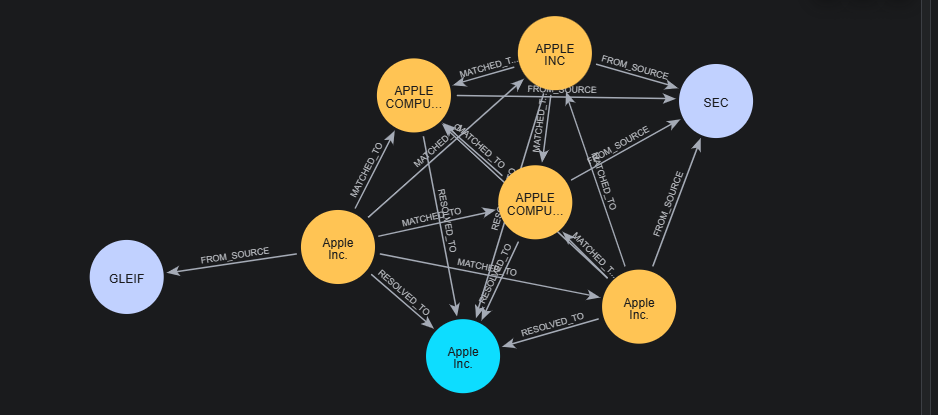
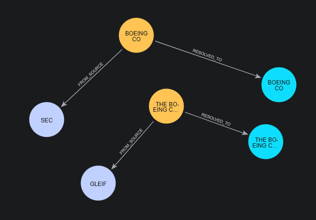

# Resolving Companies Across SEC EDGAR and GLEIF When There Is No Shared Key

*What it takes to link two authoritative company registries that were never designed to be joined — and how to prove you got it right, on real public data, with zero false merges on this held-out 49-company benchmark.*


## The JOIN you can't write

Here is a problem that looks trivial until you try it. The U.S. Securities and Exchange Commission publishes EDGAR, a registry of every company that files with it, keyed on a **CIK** (Central Index Key). The Global Legal Entity Identifier Foundation publishes GLEIF, a global registry of legal entities, keyed on an **LEI** (Legal Entity Identifier). Both describe Apple, Microsoft, IBM, and thousands of other companies. Both are free, current, and redistributable.

Now put them in the same database and write the query that says "these two rows are the same company."

You can't. There is no shared key. CIK and LEI are issued by different authorities that never coordinated, and neither the SEC data nor the basic GLEIF fields used here give you a ready-made CIK-to-LEI join key. The only thing the two registries agree on is a **company name** (spelled differently in each) and a **postal address** (formatted differently in each). That's it. `SELECT ... JOIN ... ON` has nothing to join on.

This is the essence of **entity resolution**: deciding that two records refer to the same real-world thing when no identifier tells you so. It shows up everywhere — customer masters, supplier consolidation, healthcare identity, deduplicating a CRM after an acquisition. Company resolution across SEC and GLEIF is a particularly honest instance of it, because the ground truth exists (both registries *do* have identifiers) but you're forbidden from using it to match — so you can measure exactly how well name-and-address resolution actually works.

This article walks through doing it end to end with [Linkuity](https://github.com/linkuity/linkuity), an open-source entity-resolution engine, and — more importantly — through the general lessons the exercise teaches: **blocking is the ceiling on your recall, precision-first tuning is a deliberate choice, and you have not resolved anything until you've validated against ground truth you held out.**

## The data: two registries, no bridge

The [showcase](https://github.com/linkuity/linkuity/tree/main/showcases/company-resolution) covers 49 well-known public companies.

| Source | Provides | Identifier | License |
|--------|----------|-----------|---------|
| SEC EDGAR | EDGAR-conformed name, former filer names, business address | CIK | US-gov public domain |
| GLEIF | legal name, legal / HQ address | LEI | CC0 |

For each company, one GLEIF record and one current SEC record are projected into the input, **plus one extra SEC record for every retired filer name** a company has. Apple, for instance, contributes four SEC rows — its current `Apple Inc.` plus the historical `APPLE INC`, `APPLE COMPUTER INC`, and `APPLE COMPUTER INC/ FA` — and one GLEIF row. That yields **107 input records that should resolve to 49 companies**: a gap the matcher has to close using fuzzy name and address alone.

One honesty note baked into the data preparation, because it materially changes what can match: GLEIF exposes both a `legalAddress` and a `headquartersAddress`. The legal address is frequently a shared registered-agent address — a single Delaware "C/O Corporation Trust Center" used by hundreds of unrelated companies. Matching on *that* would manufacture false positives by the dozen. The showcase deliberately uses GLEIF's **headquarters address** — usually more comparable to SEC's business address than the legal address, though not guaranteed to be a true operating HQ (Boeing's, as we'll see, is itself a Delaware registered-agent address) — falling back to the legal address only when no HQ address exists. Which address you pick is a modeling decision, not a detail — and it belongs in the open, not buried in a script.

## The pipeline

Entity resolution is not one algorithm; it's a pipeline of them. Linkuity's stages, and the exact configuration this showcase uses, are declared in a single JSON profile — no code. This is an abbreviated view; the [full profile](https://github.com/linkuity/linkuity/blob/main/showcases/company-resolution/run/company.profile.json) also declares the `source` field, `normalizationStrategy`, `candidateRetrievalStrategy`, and `decisionStrategy`:

```json
{
  "contentType": "organization",
  "fields": [
    { "name": "organization_name", "semanticType": "OrganizationName",
      "roles": ["Searchable","Matchable","Blocking"], "similarityEvaluator": "jaccard", "weight": 4.0 },
    { "name": "address_line", "semanticType": "AddressLine",
      "roles": ["Searchable","Matchable"], "similarityEvaluator": "jaccard", "weight": 2.5 },
    { "name": "postal_code", "semanticType": "PostalCode",
      "roles": ["Matchable"], "similarityEvaluator": "exact", "weight": 0.5 }
  ],
  "blockingStrategies": ["exact-value", "token-name", "prefix"],
  "similarityStrategy": "field-weighted",
  "scoringStrategy": "identifier-weighted",
  "clusteringStrategy": "union-find",
  "autoMatchThreshold": 0.41,
  "reviewThreshold": 0.31
}
```

Read top to bottom, that says: match organizations on name (heavily), address (moderately), and postal code (lightly, exact); generate candidate pairs by blocking; score each pair as a weighted average of per-field similarity; cluster the matches; and auto-merge anything scoring ≥ 0.41. **Note what's absent: there is no identifier field.** CIK and LEI are nowhere in this profile — they live only in the held-out ground truth. Everything below is name-and-address resolution.

### Stage 1 — Blocking, and why it's the ceiling on recall

You cannot compare all 107 records to each other and call it a day at this scale — but at real scale (millions of records) the O(n²) comparison is fatal, so every entity-resolution system starts with **blocking**: cheaply bucketing records by a key, and only comparing records that share a bucket. Linkuity's batch path always runs blocking-gated retrieval — a pair that shares no blocking key is **never scored, never even considered.**

That single sentence is the most important thing to understand about entity resolution, so let's make it concrete. This profile uses two name-based blocking strategies:

- **`prefix`** — the first 4 characters of the normalized name. `MICROSOFT CORP` normalizes to `microsoftcorp` → `micr`; `MICROSOFT CORPORATION` → `microsoftcorporation` → `micr`. Same bucket. The abbreviation difference that would defeat an exact join is invisible to a 4-character prefix.
- **`token-name`** — the last token of the name. `APPLE INC` → `inc`; `APPLE COMPUTER INC` → `inc`. Same bucket.

Between them, all five Apple records land together (they share the prefix `appl`), Microsoft's two records meet (`micr`), IBM's meet (`inte`), and the matcher gets its chance to compare them.

Now watch the same mechanism *fail*, on purpose and instructively. GLEIF lists Boeing as `THE BOEING COMPANY`; SEC lists it as `BOEING CO`. To a human these are obviously the same company. To the blocker:

- prefix: `theboeingcompany` → `theb` versus `boeingco` → `boei`. **Different bucket.**
- token-name: last token `company` versus `co`. **Different bucket.**

The leading article word "The" shifts every prefix and the suffix abbreviation splits the last token, so **Boeing's two records share no blocking key and are never compared.** The same `THE X COMPANY` vs `X CO` pattern also separates Coca-Cola, Procter & Gamble, and Walt Disney in this dataset. No amount of clever scoring can save them, because scoring never runs on that pair. **Your blocking keys are a hard ceiling on your recall.** Every entity-resolution project lives or dies here, and the failure is silent — the pair simply never appears, so nothing logs "I declined to match these." (The fix is equally instructive: broaden the blocking — e.g. strip leading stop-words like "The", or add a phonetic or n-gram key — trading a larger candidate set for higher recall. This showcase leaves the gap visible rather than papering over it.)

### Stage 2 — Similarity and scoring

For every candidate pair, each matchable field produces a similarity in [0, 1]:

- **`jaccard`** on `organization_name` and `address_line` — token-set overlap, |A∩B| / |A∪B|. `MICROSOFT CORP` vs `MICROSOFT CORPORATION` share only the token `microsoft` out of three distinct tokens → 0.33. Jaccard is the right tool for company names: it rewards shared distinctive words and is unbothered by word order or a differing legal suffix, where a raw edit-distance ratio would be dragged down by `corp`/`corporation`.
- **`exact`** on `postal_code` — 1.0 or 0.0.

These combine into a **weighted average**: `Σ(weightᵢ · similarityᵢ) / Σ(weightᵢ)`, over the fields present on both records. So Microsoft — names only 0.33 alike, but a near-identical street address weighted 2.5× — clears the bar on the strength of the address. IBM is subtler still: SEC writes `1 NEW ORCHARD ROAD` and GLEIF writes `ONE NORTH CASTLE DRIVE` for the same Armonk campus (completely different strings), but the names are strongly alike **and both carry postal code `10504`** — the exact-matching postal signal plus name similarity bridges a pair whose address lines look nothing alike.

Crucially, **the score is not a black box.** Linkuity records each field's contribution — signal, value, weight, and its share of the total — and `match explain` will print them one row per factor. In master data management, "the system merged them" is not an acceptable answer to a data steward; "they scored 0.49: name 0.33 × 4.0, address 0.83 × 2.5, postal 0 × 0.5" is.

### Stage 3 — Decision, clustering, and the golden record

The weighted score falls into one of three bands: **auto-merge** (≥ 0.41), **review** (≥ 0.31), or **no-match**. Auto-merge edges are fed to a **union-find** clustering pass (connected components with path compression and union-by-rank) that turns pairwise matches into entities: if SEC-Apple matches GLEIF-Apple and GLEIF-Apple matches SEC-Apple-former-name, all three land in one cluster transitively, even if some pairs never scored directly.

Each cluster is then merged into one **golden record** via a field-level source-priority policy. Here `organization_name` prefers GLEIF's legal name, while `address_line` and `postal_code` prefer SEC's business address — so the golden Apple record reads `Apple Inc.` (from GLEIF) at `ONE APPLE PARK WAY, CUPERTINO, CA` (from SEC). The golden record is a **composite, not a copy** of any single source.



## The part most demos skip: proving it

It is easy to build a resolver that produces confident-looking output. It is the *validation* that makes it engineering. Because both registries actually have identifiers, we can hold out a **CIK↔LEI crosswalk** — a mapping the matching profile never sees — and score the golden records against it after the fact.

```
==> Company-resolution scorecard
    golden records : 60  (expected 60)
    companies      : 49
    correctly unified : 38
    left separate     : 11
    incorrect merges  : 0
    precision 100.0%  recall 80.6%  F1 89.2%
```

Read that carefully. 107 records collapsed into **60 golden organizations** (not the ideal 49 — 11 companies were left split). Of the pairs the matcher *did* merge on this held-out set, **zero were wrong** (100% pairwise precision). Of the pairs it *should* have merged, it caught 80.6% (recall). Because the crosswalk is never referenced by the profile, a passing scorecard proves genuine name-and-address resolution — not an ID lookup wearing a fuzzy-matching costume.

The eleven left-separate companies are reported by name, honestly, every run:

- **The blocking misses** — Boeing, Coca-Cola, Procter & Gamble, Walt Disney, 3M, Intel, AT&T, Ford, Texas Instruments, Starbucks. Mostly the `THE X COMPANY` vs `X CO` prefix split from Stage 1, plus a few whose SEC and GLEIF names diverge past a shared 4-char stem.
- **The genuine rebrand** — Verizon. SEC carries the retired filer name `BELL ATLANTIC CORP` at the same address as `VERIZON COMMUNICATIONS INC.`. `BELL ATLANTIC` and `VERIZON COMMUNICATIONS` share *no* name tokens, so even though the addresses match, the matcher correctly refuses to guess that a company rebranded. That's not a bug — bridging a rebrand from name and address alone would be a hallucination.

### What a left-separate case looks like in the graph

Pull Boeing's records out of the resolved graph and the failure is visual — two disconnected islands, not one cluster:



SEC's `BOEING CO` resolves to one golden organization; GLEIF's `THE BOEING COMPANY` resolves to a *different* one. Each source record is joined to its `Source` and to its own golden record by a `RESOLVED_TO` edge — but there is **no `MATCHED_TO` edge between the two orange source nodes.** That missing edge is the whole story: because the two records never shared a blocking key, they were never compared, so a match edge could never form, so union-find had nothing to connect. Set this beside Apple's fully-connected cluster from Stage 3 — the presence or absence of those `MATCHED_TO` edges is the entire difference between one golden record and two. Multiply this one missing edge across eleven companies and you get 60 golden organizations instead of the ideal 49.

## Precision-first tuning is a decision, not a default

Why is the auto-merge threshold **0.41** — a number that looks alarmingly low if you expect matches to score near 1.0? Because in master data management the two kinds of error are not equal. A **false merge** silently fuses two different companies into one golden record and corrupts every downstream report; unwinding it later is expensive and often undetected. A **missed merge** leaves two records where there should be one — visible, safe, fixable. So the threshold was tuned down until recall was as high as it could go **while incorrect merges stayed at exactly zero.** That's the tradeoff made explicit: 80.6% recall bought at 100% precision, on purpose.

And when you genuinely need to close the recall gap? The lever is sitting right there, deliberately unused: feed the CIK↔LEI crosswalk into the profile as an **`Identifier` field**. An exact identifier match floors a pair straight into the auto band regardless of name or address, instantly unifying every hard case. This showcase withholds that strong key precisely so it can measure how far fuzzy resolution gets *without* it. In production you'd use every reliable key you have — the point of the exercise is to know what the fuzzy layer contributes underneath.

## Run it yourself

Offline, from committed data, in about fifteen seconds (needs only the .NET 10 SDK and PowerShell 7):

```powershell
git clone https://github.com/linkuity/linkuity.git
cd linkuity
./showcases/company-resolution/run-demo.ps1
```

It runs the resolution and prints the scorecard above. Add `-Neo4j` to emit a graph export you can load into Neo4j and explore the clusters visually; add `-Refresh -UserAgent "you@example.com"` to re-pull live SEC + GLEIF data and rebuild the input from scratch.

## Takeaways

Whether or not you ever touch SEC and GLEIF, the lessons port to any entity-resolution problem:

1. **When there's no shared key, resolution is your only option** — and it's a pipeline (normalize → block → score → decide → cluster → merge), not a single fuzzy-match call.
2. **Blocking sets your recall ceiling.** Records that share no blocking key are never compared. Most "the matcher missed an obvious pair" bugs are blocking bugs, and they fail silently — audit your blocking before you tune your scoring.
3. **Pick the right similarity for the field.** Token Jaccard for multi-word names, exact for codes, edit-distance for typos. One evaluator does not fit all fields.
4. **Tune precision-first when a false merge is the expensive error** — and state the tradeoff out loud instead of chasing a single accuracy number.
5. **You haven't resolved anything until you've validated against held-out truth.** Confident output is not correct output. If you can hold out an identifier and score against it, do — and report your failures by name.

The full, reproducible showcase — data, profile, validator, and honest scorecard — is on [GitHub](https://github.com/linkuity/linkuity/tree/main/showcases/company-resolution).
