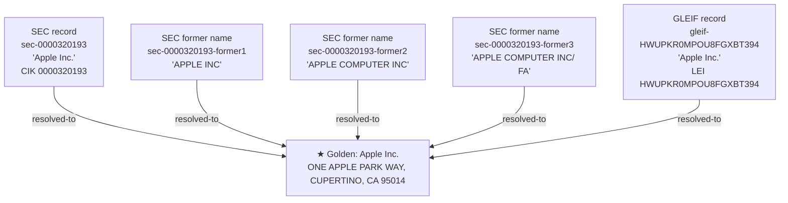

# Golden organization graph

One golden organization, resolved from five source records across two independent
public systems — SEC EDGAR and GLEIF — with no shared key between them:

Every source record shares the same address (One Apple Park Way, Cupertino, CA 95014)
even though the names range from the current legal name to two retired SEC filer
names — and the GLEIF record carries an independently issued LEI with no CIK in
common. Linkuity resolves all five into a single golden organization on fuzzy
name + address alone.

Reproduce the full graph in Neo4j by running the demo with `-Neo4j` and loading
`output/neo4j-export.zip`'s `load.cypher`.
