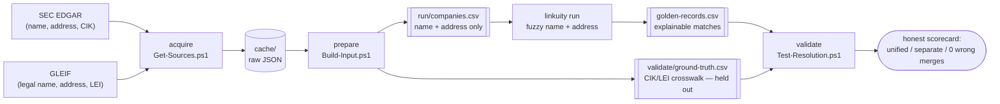

# Pipeline

```mermaid
flowchart LR
  SEC["SEC EDGAR<br/>(name, address, CIK)"] --> ACQ[acquire<br/>Get-Sources.ps1]
  GLEIF["GLEIF<br/>(legal name, address, LEI)"] --> ACQ
  ACQ --> CACHE[(cache/<br/>raw JSON)]
  CACHE --> PREP[prepare<br/>Build-Input.ps1]
  PREP --> INPUT[[run/companies.csv<br/>name + address only]]
  PREP --> GT[[validate/ground-truth.csv<br/>CIK/LEI crosswalk — held out]]
  INPUT --> LK["linkuity run<br/>fuzzy name + address"]
  LK --> GOLD[[golden-records.csv<br/>explainable matches]]
  GOLD --> VAL[validate<br/>Test-Resolution.ps1]
  GT --> VAL
  VAL --> SCORE(["honest scorecard:<br/>unified / separate / 0 wrong merges"])
```
